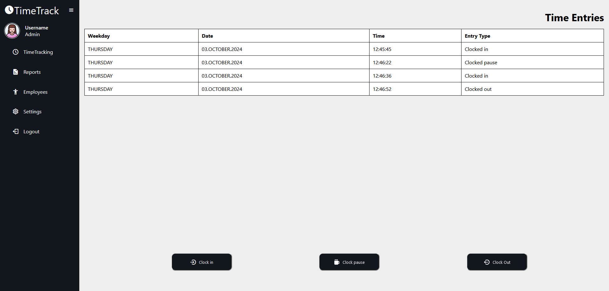

<a id="readme-top"></a>

# Time Tracking System

<details>
  <summary>Table of Contents</summary>
  <ol>
    <li>
      <a href="#about-the-project">About The Project</a>
      <ul>
        <li><a href="#built-with">Built With</a></li>
      </ul>
    </li>
    <li>
      <a href="#getting-started">Getting Started</a>
      <ul>
        <li><a href="#prerequisites">Prerequisites</a></li>
        <li><a href="#setup">Setup</a></li>
        <li><a href="#running-tests">Running Tests</a></li>
      </ul>
    </li>
    <li><a href="#screenshots">Screenshots</a></li>
    <li><a href="#license">License</a></li>
    <li><a href="#attribution">Attribution</a></li>
  </ol>
</details>

<div align="center">
   <a href="https://github.com/ffeusthuber/TimeTrackingSystem">
    
  </a>
</div>

## About the project
⚠️ The software is currently being developed. New features, enhancements, and bug fixes are continually being added.⚠️

This project is a web application built with Spring, aimed at providing a comprehensive time-tracking solution for employees.
The main goal of the project is to practice several key software development principles and techniques, including:

- **Test-Driven Development (TDD)**: Guiding design by writing tests first before implementing functionality.
- **Object-Oriented Programming (OOP)**: Applying OOP principles for a modular and reusable codebase.
- **Hexagonal Architecture**: Applying the Hexagonal Architecture (Ports and Adapters) to ensure the separation of concerns and maintainable code.

<p align="right">(<a href="#readme-top">back to top</a>)</p>

### Features
- User Authentication and Authorization
- Clocking in/out and pausing work
- Data Visualization and Reporting

<p align="right">(<a href="#readme-top">back to top</a>)</p>

### Built With
- **Java**: The core programming language.
- **Spring Boot**: Framework for building web applications.
- **Spring Security**: Provides security features for authentication and authorization
- **Thymeleaf**: Template engine for web applications.
- **Maven**:  Dependency management and project structure.
- **JUnit**: Framework for writing and running unit tests.
- **Mockito**: Library for creating mock objects in tests.

<p align="right">(<a href="#readme-top">back to top</a>)</p>

## Getting Started

To get a local copy of the project up and running, follow these steps:

### Prerequisites

- **Maven 3.6.0** or higher

### Setup

1. Clone the repository:
    ```sh
    git clone https://github.com/ffeusthuber/TimeTrackingSystem.git
    cd TimeTrackingSystem
    ```
2. Configure the properties for the initial admin:
   * Edit the `initial-admin.properties` file located in `src/main/resources/properties` to setup the initial admin credentials: </br>
    ```sh
    admin.firstname=yourFirstName
    admin.lastname=yourLastName
    admin.email=yourEmail@admin.com
    admin.password=yourPassword
    ```
3. Build the project using Maven:
    ```sh
    mvn clean install
    ```
4. Run the application:
    ```sh
    mvn spring-boot:run
    ```

### Running Tests

To run the tests and ensure the application functions as intended, use the following Maven command:
```sh
mvn test
```

<p align="right">(<a href="#readme-top">back to top</a>)</p>

## Screenshots
<div align="center">
   <a href="https://github.com/ffeusthuber/TimeTrackingSystem">
    
  </a>
</div>
<br/>


<p align="right">(<a href="#readme-top">back to top</a>)</p>

## License

Distributed under the MIT License. See `LICENSE.txt` for more information.

## Attribution
<ul>
<li><a href="https://www.flaticon.com/free-icons/clock" title="clock icons">Clock icons created by Freepik - Flaticon</a></li>
</ul>

<p align="right">(<a href="#readme-top">back to top</a>)</p>

